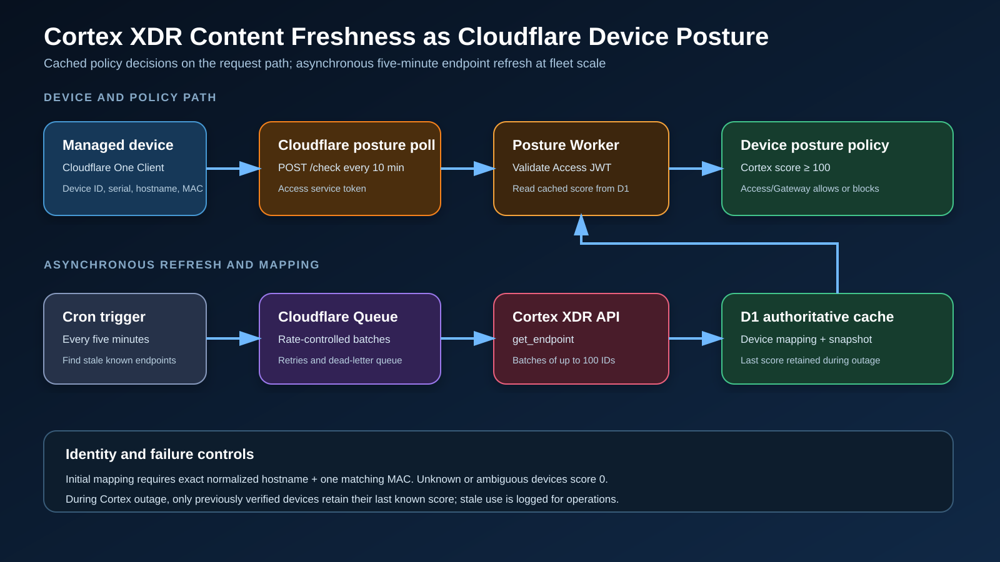
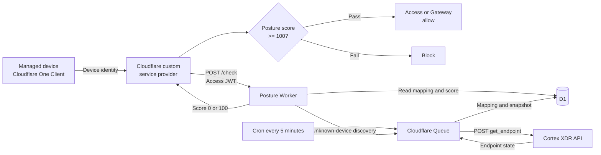

# Cloudflare Cortex XDR Device Posture Worker

This project connects Cloudflare Zero Trust device posture with Palo Alto
Cortex XDR. It allows an Access or Gateway policy to require both of these
conditions before granting access:

- The Cortex endpoint is `protected`.
- Its security content was updated within the last seven days.

The integration is designed for approximately 5,000 to 50,000 devices. The
normal posture request reads cached results from D1 and does not wait for the
Cortex API.

## Architecture





The system has two separate paths:

1. **Posture evaluation path:** Cloudflare calls the Worker, the Worker reads
   D1, and a score is returned immediately.
2. **Cortex refresh path:** Cron and Queue consumers call Cortex asynchronously
   and update D1 for later posture requests.

This separation prevents Cortex latency or rate limits from slowing every
Cloudflare posture poll.

## Components

| Component | Responsibility |
| --- | --- |
| Cloudflare One Client | Supplies device ID, serial, hostname, MAC, user email, and WARP virtual IP |
| Custom service provider | Polls the Worker and stores the returned score for each device |
| Cloudflare Access | Protects the Worker with a service token and issues the application JWT |
| Worker HTTP handler | Validates Access, reads D1, returns posture scores, and queues unknown devices |
| D1 | Stores verified device mappings, Cortex endpoint snapshots, scores, refresh leases, and integration health |
| Cron trigger | Runs every five minutes and finds endpoint snapshots that need refreshing |
| Cloudflare Queue | Buffers and rate-controls Cortex lookups, retries failures, and sends exhausted jobs to a DLQ |
| Cortex XDR API | Returns endpoint identity, protection status, content update time, and last-seen time |
| Access/Gateway policy | Allows or blocks based on the Cloudflare posture check result |

## Runtime Flow

### 1. Cloudflare evaluates device posture

Cloudflare invokes:

```http
POST https://<worker-hostname>/check
Cf-Access-Jwt-Assertion: <access-application-jwt>
Content-Type: application/json
```

Example request:

```json
{
  "devices": [
    {
      "device_id": "9ece5fab-7398-488a-a575-e25a9a3dec07",
      "email": "jdoe@example.com",
      "serial_number": "PF123ABC",
      "mac_address": "00:11:22:33:44:55",
      "virtual_ipv4": "100.96.0.10",
      "hostname": "LAPTOP-001"
    }
  ]
}
```

The Worker accepts up to 1,000 devices and limits the request body to 1 MiB.
It validates the Access JWT signature, issuer, audience, expiry, and algorithm.
The signing keys are obtained from:

```http
GET https://<team-name>.cloudflareaccess.com/cdn-cgi/access/certs
```

For each device, the Worker reads its verified mapping and latest endpoint
snapshot from D1. It returns exactly one result per Cloudflare `device_id`:

```json
{
  "result": {
    "9ece5fab-7398-488a-a575-e25a9a3dec07": {
      "s2s_id": "cortex-endpoint-id",
      "score": 100
    }
  }
}
```

`s2s_id` is the Cortex `endpoint_id`. Cloudflare evaluates the configured
service-provider posture check, normally `Score >= 100`, and makes the result
available to Access and Gateway policies.

### 2. A new device is discovered

If D1 has no verified mapping, the Worker:

1. Returns score `0` for that poll.
2. Sends the device to the `cortex-posture-refresh` Queue.
3. The Queue consumer searches Cortex by normalized hostname.
4. The consumer requires exactly one result with the same hostname and at least
   one matching MAC address.
5. It stores `Cloudflare device_id -> Cortex endpoint_id` in D1.
6. It evaluates and stores the Cortex snapshot.
7. The next Cloudflare poll receives the cached score.

Hostname alone is never enough to create a mapping. If no MAC is present, or
more than one Cortex endpoint matches, the device remains unmapped and scores
`0`.

The Worker also rechecks the stored hostname, verified MAC, and serial number
when Cloudflare sends later requests. Changed identity data scores `0` and
triggers rediscovery.

### 3. Known endpoints are refreshed

The Cron trigger runs every five minutes:

1. Select endpoint snapshots older than `SNAPSHOT_REFRESH_MINUTES`.
2. Claim a 15-minute D1 refresh lease to prevent duplicate cron fan-out.
3. Group Cortex endpoint IDs into batches of up to 100.
4. Send refresh messages to the Queue.
5. Queue consumers call Cortex with a maximum concurrency of five.
6. Store the returned endpoint snapshot and newly calculated score in D1.
7. Release the refresh lease.

Queue messages retry five times with delay. Exhausted messages go to
`cortex-posture-refresh-dlq`.

## APIs Used

### Worker API

| Method and path | Called by | Purpose |
| --- | --- | --- |
| `POST /check` | Cloudflare custom service provider | Return `s2s_id` and score for every device |
| `GET /health` | Authorized operator or monitor | Return non-sensitive Cortex integration health timestamps |

Both endpoints require a valid `Cf-Access-Jwt-Assertion` from the configured
Access application.

### Cloudflare Access certificates API

```http
GET https://<team-name>.cloudflareaccess.com/cdn-cgi/access/certs
```

The `jose` library uses this JWKS endpoint to verify the Access application
token. The Worker requires the configured issuer and application AUD.

### Cortex endpoint API

```http
POST https://<cortex-api-fqdn>/public_api/v1/endpoints/get_endpoint
Content-Type: application/json
x-xdr-auth-id: <api-key-id>
Authorization: <api-key-or-advanced-hash>
```

The Worker uses two Cortex filters.

**Initial discovery by hostname:**

```json
{
  "request_data": {
    "filters": [
      {
        "field": "hostname",
        "operator": "in",
        "value": ["laptop-001"]
      }
    ],
    "search_from": 0,
    "search_to": 100,
    "sort": {
      "field": "last_seen",
      "keyword": "DESC"
    }
  }
}
```

**Refresh known Cortex endpoints:**

```json
{
  "request_data": {
    "filters": [
      {
        "field": "endpoint_id_list",
        "operator": "in",
        "value": ["cortex-endpoint-id-1", "cortex-endpoint-id-2"]
      }
    ],
    "search_from": 0,
    "search_to": 100,
    "sort": {
      "field": "last_seen",
      "keyword": "DESC"
    }
  }
}
```

The implementation consumes these response fields:

| Cortex field | Use |
| --- | --- |
| `endpoint_id` | Stable third-party ID stored as `s2s_id` |
| `endpoint_name` | Compared with the Cloudflare hostname during discovery |
| `mac_address[]` | Confirms the first device mapping |
| `operational_status` | Must equal `protected` |
| `last_content_update_time` | Must be no older than the configured number of days |
| `last_seen` | Optional endpoint check-in freshness requirement |

The Cortex response is capped at 4 MiB and API calls use a configurable timeout
with bounded retries for network errors, `429`, and `5xx` responses.

### Cortex authentication

Standard keys send the API key directly in `Authorization`.

Advanced keys generate these values for every request:

```text
nonce = 64 random alphanumeric characters
timestamp = current epoch milliseconds
Authorization = lowercase_hex(SHA256(api_key + nonce + timestamp))
```

The request also includes `x-xdr-nonce` and `x-xdr-timestamp`.

## Mapping Logic

Cortex does not expose the hardware serial number in the documented endpoint
response, so there is no direct serial-to-serial match.

The initial mapping therefore requires:

```text
Cloudflare hostname == Cortex endpoint_name
AND
Cloudflare MAC intersects Cortex mac_address[]
AND
exactly one Cortex endpoint matches
```

After discovery, D1 stores:

```text
Cloudflare device_id and serial
    -> Cortex endpoint_id
    -> verified hostname and MAC
```

For stronger identity, populate a Cortex tag or alias from an MDM/CMDB with the
Cloudflare serial number and extend the matching logic to use it.

## Scoring

| Condition | Score | Reason |
| --- | ---: | --- |
| Protected and content age is within the configured limit | `100` | `protected_and_content_fresh` |
| Endpoint is not protected | `0` | `operational_status_<value>` |
| Content update is missing or older than seven days | `0` | `last_content_update_missing` or `content_older_than_allowed` |
| Optional last-seen check fails | `0` | `last_seen_missing` or `endpoint_not_seen_recently` |
| Endpoint is missing from a successful Cortex response | `0` | `endpoint_missing` |
| Device is unknown, changed, or ambiguous | `0` | No verified mapping |

`MAX_LAST_SEEN_MINUTES=0` disables the optional last-seen requirement.

## Cortex Outage Behavior

This deployment uses controlled fail-open behavior:

- A previously verified device retains its last stored score while Cortex is
  unavailable.
- A previously failing device remains failed.
- An unknown or ambiguous device never passes because of an outage.
- A successful Cortex response that confirms an endpoint is missing changes its
  score to `0`.
- Stale score use, Queue failures, and Cortex errors are logged as structured
  Worker events.

Create a separate emergency Access policy for a small administrator group
before enforcing this check broadly.

## D1 Data Model

| Table | Contents |
| --- | --- |
| `device_mappings` | Cloudflare device ID, serial, Cortex endpoint ID, verified hostname/MAC, mapping status |
| `endpoint_snapshots` | Cortex state, timestamps, score, reason, and refresh time |
| `integration_status` | Last Cortex success/error timestamps and health state |
| `refresh_leases` | Temporary claims that prevent repeated Cron refresh messages |

No Cortex API key, Access service-token secret, user email, or complete Cortex
response is stored in D1 or application logs.

## Configuration

Non-secret settings are in `wrangler.jsonc`:

| Variable | Example | Description |
| --- | --- | --- |
| `ACCESS_TEAM_DOMAIN` | `https://example.cloudflareaccess.com` | Expected Access JWT issuer |
| `ACCESS_AUD` | Access application AUD | Expected Access JWT audience |
| `CORTEX_BASE_URL` | `https://api-tenant.example` | HTTPS Cortex tenant API origin, without a path |
| `CORTEX_KEY_TYPE` | `advanced` | `standard` or `advanced` |
| `MAX_CONTENT_AGE_DAYS` | `7` | Maximum allowed content age |
| `MAX_LAST_SEEN_MINUTES` | `0` | Optional check-in age; zero disables it |
| `CORTEX_TIMEOUT_MS` | `15000` | Cortex request timeout |
| `SNAPSHOT_REFRESH_MINUTES` | `5` | Age at which snapshots are queued for refresh |

Secrets are stored with Wrangler, never in `wrangler.jsonc`:

```bash
npx wrangler secret put CORTEX_API_KEY
npx wrangler secret put CORTEX_API_KEY_ID
```

## Deployment

### 1. Install and verify

```bash
npm install
npm run check
```

`npm run check` generates Worker binding types, type-checks, lints, runs tests,
and performs a Wrangler deployment dry run.

### 2. Create Cloudflare resources

```bash
npx wrangler d1 create cortex-posture
npx wrangler queues create cortex-posture-refresh
npx wrangler queues create cortex-posture-refresh-dlq
```

Put the returned D1 database ID in `wrangler.jsonc`, then apply the schema:

```bash
npm run migrate:remote
```

### 3. Configure Access and Cortex

1. Set the Access team domain, Access application AUD, Cortex API origin, and
   key type in `wrangler.jsonc`.
2. Add both Cortex secrets using `wrangler secret put`.
3. Deploy the Worker on a custom hostname.
4. Protect that hostname with an Access self-hosted application.
5. Add a **Service Auth** policy that includes the posture service token.

### 4. Deploy

```bash
npm run deploy
```

### 5. Configure Cloudflare device posture

In Cloudflare Zero Trust:

1. Go to **Integrations > Service providers**.
2. Add a **Custom service provider**.
3. Enter the Access service-token client ID and secret.
4. Set the REST API URL to `https://<worker-hostname>/check`.
5. Use a polling frequency such as ten minutes.
6. Under **Reusable components > Posture checks > Service provider checks**,
   create a check requiring score `>= 100`.
7. Verify healthy and unhealthy devices in posture logs before enforcement.
8. Add the posture check to a pilot Access or Gateway policy.

Set posture expiration to at least twice the polling frequency. Gateway may add
up to another five minutes before observing a changed posture result.

The complete operational procedure is in
[docs/deployment.md](docs/deployment.md).

## Local Development

```bash
npm install
cp .dev.vars.example .dev.vars
npm run types
npm run migrate:local
npm run dev
```

Put local Cortex credentials in `.dev.vars`. It is excluded from Git.

## Operations

```bash
# Stream structured Worker logs
npm run tail

# Inspect deployment versions
npx wrangler versions list

# Roll back if required
npx wrangler rollback
```

The currently provisioned Worker URL is:

```text
https://cloudflare-cortex-posture-worker.pongpisit.workers.dev
```

It remains intentionally non-operational until the placeholder Access and
Cortex tenant values are replaced and Cortex secrets are configured.
