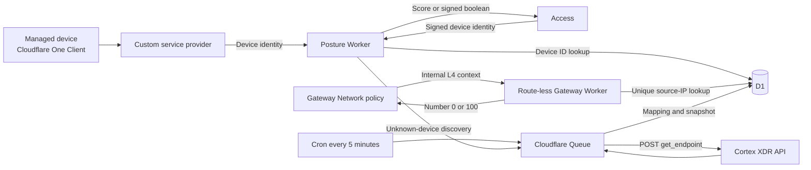

# Cloudflare Cortex XDR Device Posture Worker

This project connects Cloudflare Zero Trust device posture with Palo Alto
Cortex XDR. It allows an Access or Gateway policy to require both of these
conditions before granting access:

- The Cortex endpoint is `protected`.
- Its security content was updated within the last seven days.

The integration is designed for approximately 5,000 to 50,000 devices. The
normal posture request reads cached results from D1 and does not wait for the
Cortex API.

## Architecture




The system has four separate paths:

1. **Posture evaluation path:** Cloudflare calls the Worker, the Worker reads
   D1, and a score is returned immediately.
2. **Cortex refresh path:** Cron and Queue consumers call Cortex asynchronously
   and update D1 for later posture requests.
3. **Access External Evaluation:** Access sends a signed identity containing the
   Cloudflare device ID. The Worker returns a nonce-bound signed boolean.
4. **Gateway Custom Function:** Gateway internally invokes a route-less Worker
   with L4 context. The Worker resolves the unique verified WARP source IP and
   returns the cached score as a number.

This separation prevents Cortex latency or rate limits from slowing every
Cloudflare posture poll.

## Components

| Component | Responsibility |
| --- | --- |
| Cloudflare One Client | Supplies device ID, serial, hostname, MAC, user email, and WARP virtual IP |
| Custom service provider | Polls the Worker and stores the returned score for each device |
| Cloudflare Access | Protects the Worker with a service token and issues the application JWT |
| Worker HTTP handler | Validates Access, reads D1, returns posture scores, and queues unknown devices |
| External Evaluation adapter | Verifies Access-signed requests and signs nonce-bound boolean decisions |
| Gateway adapter Worker | Resolves a unique verified source IP to a numeric cached score; has no public route |
| D1 | Stores verified device mappings, Cortex endpoint snapshots, scores, refresh leases, and integration health |
| Cron trigger | Runs every five minutes and finds endpoint snapshots that need refreshing |
| Cloudflare Queue | Buffers and rate-controls Cortex lookups, retries failures, and sends exhausted jobs to a DLQ |
| Cortex XDR API | Returns endpoint identity, protection status, content update time, and last-seen time |
| Access/Gateway policy | Allows or blocks based on the Cloudflare posture check result |

## Runtime Flow

### 1. Cloudflare evaluates device posture

Cloudflare invokes:

```http
POST https://<worker-hostname>/check
Cf-Access-Jwt-Assertion: <access-application-jwt>
Content-Type: application/json
```

Example request:

```json
{
  "devices": [
    {
      "device_id": "9ece5fab-7398-488a-a575-e25a9a3dec07",
      "email": "jdoe@example.com",
      "serial_number": "PF123ABC",
      "mac_address": "00:11:22:33:44:55",
      "virtual_ipv4": "100.96.0.10",
      "hostname": "LAPTOP-001"
    }
  ]
}
```

The Worker accepts up to 1,000 devices and limits the request body to 1 MiB.
It validates the Access JWT signature, issuer, audience, expiry, and algorithm.
The signing keys are obtained from:

```http
GET https://<team-name>.cloudflareaccess.com/cdn-cgi/access/certs
```

For each device, the Worker reads its verified mapping and latest endpoint
snapshot from D1. It returns exactly one result per Cloudflare `device_id`:

```json
{
  "result": {
    "9ece5fab-7398-488a-a575-e25a9a3dec07": {
      "s2s_id": "cortex-endpoint-id",
      "score": 100
    }
  }
}
```

`s2s_id` is the Cortex `endpoint_id`. Cloudflare evaluates the configured
service-provider posture check, normally `Score >= 100`, and makes the result
available to Access and Gateway policies.

### 2. A new device is discovered

If D1 has no verified mapping, the Worker:

1. Returns score `0` for that poll.
2. Sends the device to the `cortex-posture-refresh` Queue.
3. The Queue consumer searches Cortex by normalized hostname.
4. The consumer requires exactly one result with the same hostname and at least
   one matching MAC address.
5. It stores `Cloudflare device_id -> Cortex endpoint_id` in D1.
6. It evaluates and stores the Cortex snapshot.
7. The next Cloudflare poll receives the cached score.

Hostname alone is never enough to create a mapping. If no MAC is present, or
more than one Cortex endpoint matches, the device remains unmapped and scores
`0`.

The Worker also rechecks the stored hostname, verified MAC, and serial number
when Cloudflare sends later requests. Changed identity data scores `0` and
triggers rediscovery.

### 3. Known endpoints are refreshed

The Cron trigger runs every five minutes:

1. Select endpoint snapshots older than `SNAPSHOT_REFRESH_MINUTES`.
2. Claim a 15-minute D1 refresh lease to prevent duplicate cron fan-out.
3. Group Cortex endpoint IDs into batches of up to 100.
4. Send refresh messages to the Queue.
5. Queue consumers call Cortex with a maximum concurrency of five.
6. Store the returned endpoint snapshot and newly calculated score in D1.
7. Release the refresh lease.

Queue messages retry five times with delay. Exhausted messages go to
`cortex-posture-refresh-dlq`.

## APIs Used

### Worker API

| Method and path | Called by | Purpose |
| --- | --- | --- |
| `POST /check` | Cloudflare custom service provider | Return `s2s_id` and score for every device |
| `GET /health` | Authorized operator or monitor | Return non-sensitive Cortex integration health timestamps |
| `POST /external-evaluation` | Cloudflare Access | Verify a signed identity and return a signed boolean decision |
| `GET /external-evaluation/keys` | Cloudflare Access | Return the public JWKS used to verify evaluation responses |

`/check` and `/health` require a valid `Cf-Access-Jwt-Assertion`. External
Evaluation routes are public because Access calls them directly; requests are
authenticated by the signed token in the request body. The Gateway Worker has
no `workers.dev` URL or route and is invoked internally by script name.

### Cloudflare Access certificates API

```http
GET https://<team-name>.cloudflareaccess.com/cdn-cgi/access/certs
```

The `jose` library uses this JWKS endpoint to verify the Access application
token. The Worker requires the configured issuer and application AUD.

### Cortex endpoint API

```http
POST https://<cortex-api-fqdn>/public_api/v1/endpoints/get_endpoint
Content-Type: application/json
x-xdr-auth-id: <api-key-id>
Authorization: <api-key-or-advanced-hash>
```

The Worker uses two Cortex filters.

**Initial discovery by hostname:**

```json
{
  "request_data": {
    "filters": [
      {
        "field": "hostname",
        "operator": "in",
        "value": ["laptop-001"]
      }
    ],
    "search_from": 0,
    "search_to": 100,
    "sort": {
      "field": "last_seen",
      "keyword": "DESC"
    }
  }
}
```

**Refresh known Cortex endpoints:**

```json
{
  "request_data": {
    "filters": [
      {
        "field": "endpoint_id_list",
        "operator": "in",
        "value": ["cortex-endpoint-id-1", "cortex-endpoint-id-2"]
      }
    ],
    "search_from": 0,
    "search_to": 100,
    "sort": {
      "field": "last_seen",
      "keyword": "DESC"
    }
  }
}
```

The implementation consumes these response fields:

| Cortex field | Use |
| --- | --- |
| `endpoint_id` | Stable third-party ID stored as `s2s_id` |
| `endpoint_name` | Compared with the Cloudflare hostname during discovery |
| `mac_address[]` | Confirms the first device mapping |
| `operational_status` | Must equal `protected` |
| `last_content_update_time` | Must be no older than the configured number of days |
| `last_seen` | Optional endpoint check-in freshness requirement |

The Cortex response is capped at 4 MiB and API calls use a configurable timeout
with bounded retries for network errors, `429`, and `5xx` responses.

### Cortex authentication

Standard keys send the API key directly in `Authorization`.

Advanced keys generate these values for every request:

```text
nonce = 64 random alphanumeric characters
timestamp = current epoch milliseconds
Authorization = lowercase_hex(SHA256(api_key + nonce + timestamp))
```

The request also includes `x-xdr-nonce` and `x-xdr-timestamp`.

## Mapping Logic

Cortex does not expose the hardware serial number in the documented endpoint
response, so there is no direct serial-to-serial match.

The initial mapping therefore requires:

```text
Cloudflare hostname == Cortex endpoint_name
AND
Cloudflare MAC intersects Cortex mac_address[]
AND
exactly one Cortex endpoint matches
```

After discovery, D1 stores:

```text
Cloudflare device_id and serial
    -> Cortex endpoint_id
    -> verified hostname and MAC
```

For stronger identity, populate a Cortex tag or alias from an MDM/CMDB with the
Cloudflare serial number and extend the matching logic to use it.

## Scoring

| Condition | Score | Reason |
| --- | ---: | --- |
| Protected and content age is within the configured limit | `100` | `protected_and_content_fresh` |
| Endpoint is not protected | `0` | `operational_status_<value>` |
| Content update is missing or older than seven days | `0` | `last_content_update_missing` or `content_older_than_allowed` |
| Optional last-seen check fails | `0` | `last_seen_missing` or `endpoint_not_seen_recently` |
| Endpoint is missing from a successful Cortex response | `0` | `endpoint_missing` |
| Device is unknown, changed, or ambiguous | `0` | No verified mapping |

`MAX_LAST_SEEN_MINUTES=0` disables the optional last-seen requirement.

## Cortex Outage Behavior

This deployment uses controlled fail-open behavior:

- A previously verified device retains its last stored score while Cortex is
  unavailable.
- A previously failing device remains failed.
- An unknown or ambiguous device never passes because of an outage.
- A successful Cortex response that confirms an endpoint is missing changes its
  score to `0`.
- Stale score use, Queue failures, and Cortex errors are logged as structured
  Worker events.

Create a separate emergency Access policy for a small administrator group
before enforcing this check broadly.

## D1 Data Model

| Table | Contents |
| --- | --- |
| `device_mappings` | Cloudflare device ID, serial, WARP virtual IPv4, Cortex endpoint ID, verified hostname/MAC, mapping status |
| `endpoint_snapshots` | Cortex state, timestamps, score, reason, and refresh time |
| `integration_status` | Last Cortex success/error timestamps and health state |
| `refresh_leases` | Temporary claims that prevent repeated Cron refresh messages |
| `device_observations` | Latest request token per device, preventing delayed discovery jobs from restoring stale mappings |

No Cortex API key, Access service-token secret, user email, or complete Cortex
response is stored in D1 or application logs.

## Configuration

Non-secret settings are in `wrangler.jsonc`:

| Variable | Example | Description |
| --- | --- | --- |
| `ACCESS_TEAM_DOMAIN` | `https://example.cloudflareaccess.com` | Expected Access JWT issuer |
| `ACCESS_AUD` | Access application AUD | Expected Access JWT audience |
| `CORTEX_BASE_URL` | `https://api-tenant.example` | HTTPS Cortex tenant API origin, without a path |
| `CORTEX_KEY_TYPE` | `advanced` | `standard` or `advanced` |
| `MAX_CONTENT_AGE_DAYS` | `7` | Maximum allowed content age |
| `MAX_LAST_SEEN_MINUTES` | `0` | Optional check-in age; zero disables it |
| `CORTEX_TIMEOUT_MS` | `15000` | Cortex request timeout |
| `SNAPSHOT_REFRESH_MINUTES` | `5` | Age at which snapshots are queued for refresh |
| `EXTERNAL_EVAL_AUDS` | Access application AUDs | Comma-separated protected application audiences allowed to call External Evaluation |
| `EXTERNAL_EVAL_MAPPING_MAX_AGE_MINUTES` | `30` | Maximum mapping age accepted by External Evaluation |
| `GATEWAY_IP_MAX_AGE_MINUTES` | `30` | Gateway-only maximum age of a source-IP binding before it fails closed |

Secrets are stored with Wrangler, never in `wrangler.jsonc`:

```bash
npx wrangler secret put CORTEX_API_KEY
npx wrangler secret put CORTEX_API_KEY_ID
npm run key:external-evaluation | npx wrangler secret put EXTERNAL_EVAL_PRIVATE_JWK
```

## Deployment

### 1. Install and verify

```bash
npm install
npm run check
```

`npm run check` generates Worker binding types, type-checks, lints, runs tests,
and performs a Wrangler deployment dry run.

### 2. Create Cloudflare resources

```bash
npx wrangler d1 create cortex-posture
npx wrangler queues create cortex-posture-refresh
npx wrangler queues create cortex-posture-refresh-dlq
```

Put the returned D1 database ID in `wrangler.jsonc`, then apply the schema:

```bash
npm run migrate:remote
```

### 3. Configure Cortex and deploy

1. Set the Cortex API origin and key type in `wrangler.jsonc`.
2. Add both Cortex secrets using `wrangler secret put`.
3. Configure a custom Worker hostname such as
   `cortex-posture.example.com`. A custom hostname is recommended for the
   Access application used in the next section.
4. Set `EXTERNAL_EVAL_AUDS` if using Access External Evaluation.
5. Deploy the posture Worker and route-less Gateway Worker.

```bash
npm run deploy
```

## Cloudflare Zero Trust Configuration

The configuration has four distinct Cloudflare objects. They serve different
purposes and should not be combined:

1. An Access service token authenticates Cloudflare to the Worker.
2. An Access application protects the Worker itself.
3. A custom service provider calls the Worker and imports its scores.
4. A posture check converts the score into Pass/Fail for application policies.

### 1. Create the service token

In Cloudflare Zero Trust:

1. Go to **Access controls > Service credentials > Service tokens**.
2. Create a token named `Cortex posture service`.
3. Save its client ID and client secret. The secret is shown only once.

The client ID and secret are entered into the custom service provider later.
They are not Worker environment variables and must not be committed to Git.

### 2. Protect the Worker with Access

Go to **Access controls > Applications** and create a **Self-hosted**
application:

| Setting | Value |
| --- | --- |
| Name | `Cortex posture bridge` |
| Public hostname | `cortex-posture.example.com` |
| Path | `/*` |

Add this policy to the bridge application:

| Action | Rule type | Selector | Value |
| --- | --- | --- | --- |
| Service Auth | Include | Service Token | `Cortex posture service` |

Use **Service Auth**, not **Allow** or **Bypass**. The bridge application should
not require the Cortex posture check; doing that would create a circular
dependency where Cloudflare needs the check result before it can retrieve the
check result.

Copy the bridge application's **Application Audience (AUD) Tag**. Update and
redeploy these Worker variables:

```jsonc
"ACCESS_TEAM_DOMAIN": "https://<team-name>.cloudflareaccess.com",
"ACCESS_AUD": "<bridge-application-aud>"
```

The Worker validates the JWT even though Access already protects the hostname.
This rejects requests that reach the Worker through an unexpected route.

### 3. Add the custom service provider

In Cloudflare Zero Trust:

1. Go to **Integrations > Service providers**.
2. Add a **Custom service provider**.
3. Use the following values:

| Setting | Value |
| --- | --- |
| Name | `Cortex XDR` |
| Access client ID | Client ID from `Cortex posture service` |
| Access client secret | Client secret from `Cortex posture service` |
| REST API URL | `https://cortex-posture.example.com/check` |
| Polling frequency | `10 minutes` |

Select **Test and save**. This test verifies that the service token can pass the
bridge application's Service Auth policy and that the Worker responds.

### 4. Create the reusable posture check

Go to **Reusable components > Posture checks > Service provider checks** and
create:

| Setting | Value |
| --- | --- |
| Name | `Cortex protected and content fresh` |
| Provider | `Cortex XDR` |
| Selector | Score |
| Operator | Greater than or equal to |
| Value | `100` |

This converts the Worker's numerical result into a Cloudflare Pass/Fail signal.
Score `100` passes. Score `0` fails.

Set posture expiration through the Cloudflare API to at least twice the polling
frequency. For a ten-minute poll, use at least twenty minutes; thirty to sixty
minutes is a reasonable pilot setting.

### 5. Require the check in an Access policy

Open the Access application for the business resource you want to protect. This
is a different application from the `Cortex posture bridge` application.

Create or update an **Allow** policy:

| Action | Rule type | Selector | Example value |
| --- | --- | --- | --- |
| Allow | Include | Emails ending in or IdP group | `@example.com` or `Employees` |
| Allow | Require | Device posture | `Cortex protected and content fresh` |

The Include rule selects eligible users. The Require rule is an AND condition,
so a user is allowed only when identity is eligible **and** the Cortex posture
check passes. Access is default-deny; a user who does not match an Allow policy
remains blocked.

Place a narrowly scoped emergency administrator **Allow** policy above the
normal policy. Limit it to a dedicated emergency IdP group and do not use
**Bypass**, because Bypass disables Access controls and request logging.

### 6. Require the check in a Gateway policy

Gateway HTTP and Network policies can use the same posture check through the
**Passed Device Posture Checks** selector.

An HTTP allow pattern is:

| Selector | Operator | Value | Action |
| --- | --- | --- | --- |
| Domain or Application | in | Protected destination | Allow |
| Passed Device Posture Checks | in | `Cortex protected and content fresh` | Allow |

Place a matching Block rule immediately below it for the same destination. The
Allow rule admits devices that pass; the fallback rule blocks devices that do
not. Gateway evaluates rules from top to bottom, so put these rules above any
broader Allow rule.

A Network block pattern is:

| Selector | Operator | Value | Action |
| --- | --- | --- | --- |
| SNI Domain or Destination IP | is/in | Protected destination | Block |
| Passed Device Posture Checks | not in | `Cortex protected and content fresh` | Block |

The equivalent Gateway posture expression uses the posture check UUID:

```text
not(any(device_posture.checks.passed[*] in {"<POSTURE_CHECK_UUID>"}))
```

Use the Cloudflare API's **List device posture rules** endpoint to obtain the
UUID when managing policies through the API or Terraform.

### 7. Configure Access External Evaluation

External Evaluation is an alternative Access policy path that reads the same
cached score by `identity.device_id` without waiting for Cortex.

1. Set `EXTERNAL_EVAL_AUDS` to the AUD of each protected Access application,
   separated by commas, then redeploy.
2. Generate and store the response-signing key with the command in the Secrets
   section. Never commit or print the generated private JWK.
3. Add an External Evaluation `Require` rule with:

| Setting | Value |
| --- | --- |
| Evaluate URL | `https://<workers-dev-host>/external-evaluation` |
| Keys URL | `https://<workers-dev-host>/external-evaluation/keys` |

Use the `workers.dev` hostname for these routes unless the custom hostname's
Access application explicitly leaves them reachable. Access signs the incoming
JWT; the Worker verifies its signature, expiry, and application audience, then
returns a signed response with the original nonce. Unknown, invalid, or failing
devices return `success: false`.
Mappings older than `EXTERNAL_EVAL_MAPPING_MAX_AGE_MINUTES` also fail closed;
keep this value longer than the custom provider polling interval.

### 8. Configure a Gateway Custom Function

Deploy `cloudflare-cortex-posture-gateway` using `npm run deploy`, then create a
Gateway Custom Function with these values:

| Setting | Value |
| --- | --- |
| Key | `cortex_score` |
| Type | Number |
| Default value | `0` |
| Worker name | `cloudflare-cortex-posture-gateway` |

Use `custom.cortex_score >= 100` in a Gateway Network policy. The default must
remain `0`: Gateway uses it when dispatch, timeout, response parsing, or Worker
execution fails. The Gateway context does not contain a device ID, so the
adapter uses `src_ip`; it passes only when exactly one verified device mapping
has that WARP virtual IPv4. Missing, stale, or duplicate mappings return `0`.
The custom provider reverifies the binding on each successful poll; bindings
older than `GATEWAY_IP_MAX_AGE_MINUTES` also return `0`.

### 9. Verify before enforcement

1. Ensure the Cloudflare One Client is enrolled and connected on pilot devices.
2. Ensure the IdP, team domain, and protected application traffic pass through
   the Cloudflare One Client according to the device profile and Split Tunnel
   configuration.
3. Go to **Team & Resources > Devices**, select a device, and inspect its
   **Posture checks** tab.
4. Review **Insights > Logs > Posture logs** for the Cortex check.
5. Test a protected endpoint, an endpoint with content older than seven days,
   an unknown device, and a duplicate-hostname device.
6. Start with a pilot user group before expanding enforcement.

Access observes posture changes at the custom provider polling frequency.
Gateway maintains an additional local posture cache, so a changed result can
take up to another five minutes to affect new sessions. Gateway evaluates
posture when a session begins and does not terminate an already established
session solely because a later posture refresh fails.

The complete operational procedure is in
[docs/deployment.md](docs/deployment.md).

## Local Development

```bash
npm install
cp .dev.vars.example .dev.vars
npm run types
npm run migrate:local
npm run dev
```

Put local Cortex credentials in `.dev.vars`. It is excluded from Git.

## Operations

```bash
# Stream structured Worker logs
npm run tail

# Inspect deployment versions
npx wrangler versions list

# Roll back if required
npx wrangler rollback
```

The currently provisioned Worker URL is:

```text
https://cloudflare-cortex-posture-worker.pongpisit.workers.dev
```

It remains intentionally non-operational until the placeholder Access and
Cortex tenant values are replaced and Cortex secrets are configured.
