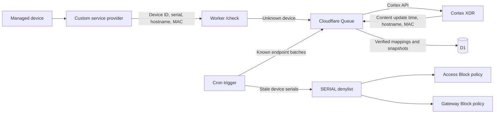

# Cloudflare Cortex XDR Noncompliance List Worker

This Worker maps Cloudflare Zero Trust devices to Cortex XDR endpoints and
maintains a Cloudflare Zero Trust serial-number list containing only devices
whose Cortex security content is too old. Access and Gateway policies use that
list as a block condition, so noncompliant devices lose access without any
per-request evaluation for healthy devices — and unknown devices intentionally
fail open until a later discovery and refresh cycle confirms they are stale.

A device is mapped to exactly one Cortex endpoint once, using the
normalized hostname disambiguated by MAC address when several Cortex
endpoints share that hostname. From then on the binding is the pair of stable
keys — Cloudflare `device_id` and Cortex `endpoint_id` — and every observed MAC
is kept in a verified MAC set. The hardware serial number is never used for
matching; it is only the enforcement key written to the denylist, and it
follows the device automatically if it changes.

The stale-content threshold defaults to seven days and is managed from the
operations dashboard, along with every other operational setting. The Worker
never creates or evaluates policies; it only maintains the list, which you
attach to policies as a condition.

## Requirements

Everything below is mandatory to run the Worker end to end:

| Requirement | Used for | Notes |
| --- | --- | --- |
| Cloudflare **Workers** with Cron Triggers | Runs the Worker; a five-minute Cron drives Cortex refreshes and list synchronization | Workers Paid plan recommended — see [usage and cost](#usage-and-cost) |
| Cloudflare **D1** database | Stores device mappings, endpoint snapshots, settings, and the debug log | Self-provisions its schema on first run; provisioned automatically by the deploy button |
| Cloudflare **Queues** (plus a dead-letter queue) | Asynchronous Cortex discovery and refresh processing with bounded retries | Provisioned automatically by the deploy button |
| Cloudflare **Zero Trust** | Hosts the `SERIAL` denylist, the custom service provider, and the Access/Gateway policies that enforce the list | Included in every Zero Trust plan, including the free tier |
| **Cloudflare One Client (WARP)** enrolled on managed devices | Supplies the device inventory (device ID, serial, hostname, MAC) and is the enforcement point for policies | Windows, macOS, and Linux — serial-number checks are unsupported on mobile platforms |
| **Cloudflare API token** with account-scoped *Zero Trust Write* | Lets the Worker maintain the serial list; also powers the dashboard's list selector | Create one under **My Profile > API Tokens** |
| **Cortex XDR API key** with endpoint-read access | Reads each endpoint's `last_content_update_time`, hostname, and MAC via `get_endpoint` | Advanced or standard key; record the API key, key ID, and tenant API URL |
| **Node.js and npm** | Deployment, tests, and the smoke test | Any current LTS release |

## Contents

- [Requirements](#requirements)
- [How it works](#how-it-works)
- [Usage and cost](#usage-and-cost)
- [Failure model](#failure-model)
- [Documentation](#documentation)

## How it works

The integration has three asynchronous stages:

1. The Cloudflare custom service provider sends device inventory to `/check`.
2. The Worker maps an unknown device to exactly one Cortex endpoint using the
   normalized hostname, disambiguated by MAC address when several Cortex
   endpoints share that hostname. The matched MAC is stored as the mapping's
   verified MAC.
3. Cron refreshes known Cortex endpoints in batches and replaces the Zero Trust
   serial list with mapped devices whose `last_content_update_time` is older
   than the configured content-age threshold.

Cortex documents `last_content_update_time` as a response field, not a
supported `get_endpoint` filter. The Worker must therefore refresh known
endpoint IDs in batches of 100, but only the much smaller noncompliant serial
set is published to Cloudflare policy.

### Endpoint identity over time

The binding is the pair **Cloudflare `device_id` → Cortex `endpoint_id`**,
established once with hostname + MAC evidence. Hostname and MAC are not the
key — they are drift signals watched on every poll:

- A MAC change on the same hostname (a swapped NIC, a VM reconfiguration, a
  docked adapter) marks the binding as drifted. The last verdict keeps
  serving, so a stale device cannot escape the denylist by changing its MAC.
  Newly observed MACs are absorbed into the verified set whenever they appear
  alongside a known one.
- A rename with MAC evidence intact marks the binding as drifted and re-runs
  discovery under the new hostname, again without dropping the current
  verdict. Renaming no longer removes a device from the denylist.
- Hostname and MAC changing together is treated as a replacement (the
  signature of a clone or a re-provisioned enrollment): the mapping is
  invalidated, a removal tombstone is written for the old serial, and
  re-discovery starts from scratch.
- A serial-number change never invalidates a binding. The denylist entry
  silently follows the current serial, so hardware replacements never leave a
  stale block in place.
- An endpoint that no longer exists in Cortex fails open: its snapshot is
  cleared so the device stays allowed, and it is retried on later cycles.
- Once per hour the Worker re-runs hostname discovery for mappings whose
  endpoint disappeared. When the Cortex agent was reinstalled on the same
  machine (new `endpoint_id`, same hostname — for example after a re-image),
  the mapping is re-pointed to the current endpoint and the snapshot is
  restored.
- Identity checks tolerate missing data: a poll that omits the MAC never
  triggers drift on a mapping that has one, and vice versa.

For every periodic mechanism and its cadence — how the D1 inventory stays
current without a nightly bulk import — see the
[data lifecycle](docs/architecture.md#data-lifecycle) in the architecture guide.

### Behavior

For an expected 12,000-device fleet with 1–5% stale endpoints, the list
normally contains approximately 120–600 serial numbers.

| Device state | List result | Policy result |
| --- | --- | --- |
| Mapped and content older than the threshold | Serial added | Blocked |
| Mapped and content becomes current | Serial removed | Allowed |
| New or unmapped device | Not added | Allowed temporarily |
| Missing hardware serial | Not added | Allowed |
| Missing content timestamp | Not added | Allowed |
| Cortex or Cloudflare API failure | Existing list preserved | Last published decision remains |

Only `last_content_update_time` determines list membership. Cortex
`operational_status` and `last_seen` do not affect the denylist.

The list is replaced as one complete set instead of applying concurrent
add/remove operations. Before writing, the Worker validates the list ID, name,
type, and configured capacity, and verifies the returned items after writing.

There is no bulk import of Cortex endpoint IDs — the Worker learns them
organically from `/check` inventory, so a device that appears in a poll is
denylist-eligible within one five-minute Cron cycle. At 10-minute provider
polling, a 12,000-device fleet is fully learned within the first one or two
polls. Endpoints that never enroll in Cloudflare are never learned, which is
correct: the denylist only affects devices Cloudflare can evaluate. Use the
dashboard's **Coverage audit** to measure the gap — it scans the recent
Cortex inventory and reports endpoints that have no Cloudflare device.

## Usage and cost

All numbers are for the reference fleet — 12,000 devices, 1–5% stale, default
intervals (4-hour detection sweep, 30-minute recovery refresh, 10-minute
provider polling) — against current Workers Paid plan pricing:

| Dimension | Estimated monthly usage | Included allowance | Overage rate |
| --- | --- | --- | --- |
| Workers requests | ~25–50k | 10M / month | $0.30 per additional million |
| Workers CPU time | ~2–5M CPU-ms | 30M / month | $0.02 per additional million |
| D1 rows written | ~9–13M | 50M / month | $1.00 per additional million |
| D1 rows read | ~50–100M | 25B / month | $0.001 per additional million |
| D1 storage | <50 MB | 5 GB | $0.75 per GB-month |
| Queues operations | ~100k | 1M / month | $0.40 per additional million |

**Bottom line: the deployment costs $5/month — the Workers Paid plan itself —
and every metered dimension stays comfortably inside the included allowances,
so the overage rates above are never charged at the reference fleet size.**

Per-device steady-state formulas for sizing your own fleet:

- D1 rows written: **~750 per healthy device per month**, plus **~5,760 per
  stale device per month** (the recovery tier), plus a once-daily last-seen
  touch.
- D1 rows read: **~4,500 per device per month**.

Scaling notes:

- The D1 write ceiling (50M rows/month) is reached at roughly **65,000
  devices** with default intervals. `DETECTION_REFRESH_MINUTES` scales writes
  linearly: raising it from 4 hours to 24 hours supports proportionally larger
  fleets.
- The Workers Free plan caps D1 at 100,000 rows written and 5 million rows
  read per day, which supports roughly **3,000–4,000 devices** at default
  intervals. Use it for pilots; use Workers Paid for production fleets. When a
  free-plan limit is hit, D1 returns errors until the daily reset — the
  failure model preserves the last published list, but decisions stop updating.

Current pricing references: [Workers](https://developers.cloudflare.com/workers/platform/pricing/),
[D1](https://developers.cloudflare.com/d1/platform/pricing/),
[Queues](https://developers.cloudflare.com/queues/platform/pricing/).

## Failure model

This design intentionally fails open for devices not already present in the
denylist:

- Unknown or not-yet-mapped devices are allowed.
- Devices without serial numbers are allowed.
- Missing content timestamps are allowed.
- A Cortex refresh failure leaves previous snapshots and list membership.
- A Cloudflare API failure leaves the existing list untouched.
- Capacity overflow refuses the entire update rather than publishing a partial
  list.

A stale device already in the list remains blocked during an outage. A newly
stale device is allowed until Cortex refresh and list synchronization succeed.

## Documentation

- [Architecture guide](docs/architecture.md) — every API call, data flow,
  comparison logic, and the D1 schema.
- [Setup guide](docs/setup.md) — deploy, Cortex configuration, serial list,
  custom provider, policies, validation, and smoke testing.
- [Dashboard guide](docs/dashboard.md) — the operations dashboard and every
  JSON endpoint.
- [Operations guide](docs/operations.md) — refresh tiers, long-term operation,
  monitoring, and configuration reference.

Quick start: use the deploy button above, follow the
[setup guide](docs/setup.md) from step 1, then run the
[smoke test](docs/setup.md#smoke-testing) and
[validation checklist](docs/setup.md#validation).
