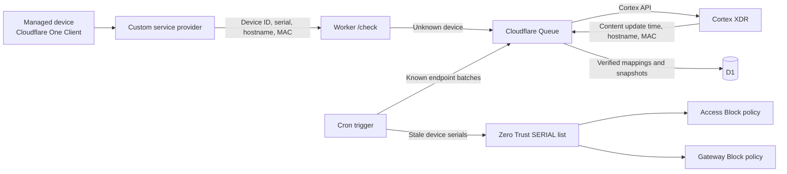

# Cloudflare Cortex XDR Noncompliance List Worker

This Worker maps Cloudflare Zero Trust devices to Cortex XDR endpoints and
maintains a Cloudflare Zero Trust serial-number list containing only devices
whose Cortex security content is too old. Access and Gateway policies use that
list as a block condition, so noncompliant devices lose access without any
per-request evaluation for healthy devices — and unknown devices intentionally
fail open until a later discovery and refresh cycle confirms they are stale.

A device is mapped to exactly one Cortex endpoint by **normalized hostname plus
MAC address**. The hardware serial number is never used for matching; it is
only the enforcement key written to the denylist, and it follows the device
automatically if it changes.

The stale-content threshold defaults to seven days and is managed from the
operations dashboard, along with every other operational setting. The Worker
never creates or evaluates policies; it only maintains the list, which you
attach to policies as a condition.

[](https://deploy.workers.cloudflare.com/?url=https://github.com/pongpisit/cloudflare-cortex-posture-worker)

## Contents

- [How it works](#how-it-works)
- [The /check endpoint](#the-check-endpoint)
- [Prerequisites](#prerequisites)
- [Setup](#setup)
  - [Deploy to Cloudflare](#deploy-to-cloudflare)
  - [Cortex configuration](#cortex-configuration)
  - [Serial list setup](#serial-list-setup)
  - [Custom provider setup](#custom-provider-setup)
  - [Securing the endpoint (optional)](#securing-the-endpoint-optional)
- [Policy setup](#policy-setup)
- [Validation](#validation)
- [Usage and cost](#usage-and-cost)
- [Dashboard](#dashboard)
- [Smoke testing](#smoke-testing)
- [Operations](#operations)
- [Long-term operation](#long-term-operation)
- [Failure model](#failure-model)
- [Reference](#reference)

## How it works



The integration has three asynchronous stages:

1. The Cloudflare custom service provider sends device inventory to `/check`.
2. The Worker maps an unknown device to exactly one Cortex endpoint using the
   normalized hostname, disambiguated by MAC address when several Cortex
   endpoints share that hostname. The matched MAC is stored as the mapping's
   verified MAC.
3. Cron refreshes known Cortex endpoints in batches and replaces the Zero Trust
   serial list with mapped devices whose `last_content_update_time` is older
   than the configured content-age threshold.

Cortex documents `last_content_update_time` as a response field, not a
supported `get_endpoint` filter. The Worker must therefore refresh known
endpoint IDs in batches of 100, but only the much smaller noncompliant serial
set is published to Cloudflare policy.

### Endpoint identity over time

The mapping identity is **hostname + MAC**: a rename or a NIC change invalidates
the mapping and triggers re-discovery. `endpoint_id` is Cortex's stable key, so
refreshes are keyed by ID. Mappings stay correct as the fleet changes:

- Every `/check` re-verifies each stored mapping against current inventory.
  A hostname or MAC change invalidates the mapping, writes a removal tombstone
  for the old serial, and triggers re-discovery under the new identity.
- A serial-number change never invalidates a mapping. The denylist entry
  silently follows the current serial, so hardware replacements never leave a
  stale block in place.
- An endpoint that no longer exists in Cortex fails open: its snapshot is
  cleared so the device stays allowed, and it is retried on later cycles.
- Once per hour the Worker re-runs hostname discovery for mappings whose
  endpoint disappeared. When the Cortex agent was reinstalled on the same
  machine (new `endpoint_id`, same hostname — for example after a re-image),
  the mapping is re-pointed to the current endpoint and the snapshot is
  restored. Decommissioned machines simply keep failing open at a bounded
  hourly retry cost.
- Identity checks tolerate missing data: a poll that omits the MAC never
  invalidates a mapping that has one, and vice versa.

### Behavior

For an expected 12,000-device fleet with 1–5% stale endpoints, the list
normally contains approximately 120–600 serial numbers.

| Device state | List result | Policy result |
| --- | --- | --- |
| Mapped and content older than the threshold | Serial added | Blocked |
| Mapped and content becomes current | Serial removed | Allowed |
| New or unmapped device | Not added | Allowed temporarily |
| Missing hardware serial | Not added | Allowed |
| Missing content timestamp | Not added | Allowed |
| Cortex or Cloudflare API failure | Existing list preserved | Last published decision remains |

Only `last_content_update_time` determines list membership. Cortex
`operational_status` and `last_seen` do not affect the denylist.

The list is replaced as one complete set instead of applying concurrent
add/remove operations. Before writing, the Worker validates the list ID, name,
type, and configured capacity. It verifies the returned items after writing.

### Cold start

There is no bulk import of Cortex endpoint IDs. The Worker learns them
organically: devices appear in `/check` inventory, are matched to Cortex
endpoints by hostname and MAC, and receive a snapshot in the same discovery
pass. A device that appears in a poll is therefore denylist-eligible within
one Cron cycle (about five minutes). At 10-minute provider polling, a
12,000-device fleet is fully learned within the first one or two polls.
Endpoints that never enroll in Cloudflare are never learned — correct, because
the denylist only affects devices Cloudflare can evaluate.

## The /check endpoint

`POST /check` expects the payload Cloudflare's custom service provider sends:
a `devices` array (up to 1,000 per request) of objects with `device_id`,
`email`, `serial_number`, `mac_address`, `virtual_ipv4`, and `hostname`. The
Worker responds with a posture score per device:

```json
{
  "result": {
    "<device_id>": { "s2s_id": "<cortex_endpoint_id>", "score": 100 }
  }
}
```

The score is retained for dashboard visibility, but it is not the enforcement
condition — the serial list is. An unmapped or invalidated device responds
with `{"s2s_id": "", "score": 0}` while discovery catches up.

## Prerequisites

- Cloudflare Workers, D1, Queues, and Zero Trust (lists, custom service
  provider, and Access/Gateway policies).
- Permission to create Zero Trust lists and policies.
- A Cloudflare API token scoped to the target account with **Zero Trust Write**.
- A Cortex XDR API key with endpoint read access.
- Node.js and npm.

Serial-number posture checks support Windows, macOS, and Linux. Cloudflare
documents mobile platforms as unsupported for serial checks; use an MDM-provided
Unique Client ID design separately if mobile enforcement is required.

## Setup

### Deploy to Cloudflare

The button at the top clones this repository into your account, provisions the
D1 database and refresh queues, applies migrations, and deploys the Worker
through [Workers Builds](https://developers.cloudflare.com/workers/ci-cd/builds/).

The deployment is intentionally inert until the remaining setup is completed:

1. Update `CORTEX_BASE_URL` in `wrangler.jsonc`.
2. Set the secrets (`CORTEX_API_KEY`, `CORTEX_API_KEY_ID`,
   `CLOUDFLARE_API_TOKEN`) in the Worker or via `.dev.vars` locally.
3. Open the dashboard, select the Zero Trust list, and enable synchronization
   (see [Dashboard](#dashboard)). All remaining configuration is managed there,
   stored in D1, and applied on the next Cron run without a redeploy.
4. Follow [Custom provider setup](#custom-provider-setup).
5. Run the [smoke test](#smoke-testing) and the [validation](#validation)
   checklist.

The repository must be public for others to use the button.

Manual alternative:

```bash
npm install
npx wrangler login

npx wrangler d1 create cortex-posture
npx wrangler queues create cortex-posture-refresh
npx wrangler queues create cortex-posture-refresh-dlq
```

Put the returned D1 ID in `wrangler.jsonc`, then:

```bash
npx wrangler secret put CORTEX_API_KEY
npx wrangler secret put CORTEX_API_KEY_ID
npx wrangler secret put CLOUDFLARE_API_TOKEN
npm run migrate:remote
npm run deploy
```

The first Cron run self-provisions the D1 schema, so the Worker recovers on a
fresh database even if migrations have not been applied yet.

Add a production [Workers Custom Domain](https://developers.cloudflare.com/workers/configuration/routing/custom-domains/),
such as `cortex-posture.example.com`, for the custom provider endpoint.

### Cortex configuration

Current Cortex navigation is **Settings > Configurations > Integrations > API
Keys > New Key**.

1. Select **Advanced** security unless the tenant requires a standard key.
2. Assign the least-privilege role that can read endpoint details through
   `POST /public_api/v1/endpoints/get_endpoint`.
3. Generate and securely record the API key. Cortex does not show it again.
4. Record the API Key ID from the API Keys page.
5. Copy the API URL and use only its HTTPS origin for `CORTEX_BASE_URL`.

The Worker consumes:

| Cortex field | Use |
| --- | --- |
| `endpoint_id` | Stable mapping target |
| `endpoint_name` | Hostname verification |
| `mac_address[]` | MAC disambiguation and identity verification |
| `last_content_update_time` | Sole noncompliance condition |

Verify the credentials and see exactly what the Worker sees, before deploying:

```bash
CORTEX_BASE_URL="https://<tenant-api-fqdn>" \
CORTEX_API_KEY="<api-key>" \
CORTEX_API_KEY_ID="<key-id>" \
npm run cortex-test [hostname]
```

The script calls `POST /public_api/v1/endpoints/get_endpoint` with the same
advanced-key signature the Worker sends (`x-xdr-auth-id`, `x-xdr-nonce`,
`x-xdr-timestamp`, and the SHA-256 authorization digest), then prints each
endpoint's `last_content_update_time`, its age, and whether it would be denied.
Pass a hostname to filter to one device, or run it without arguments to sample
five recently seen endpoints. Set `CORTEX_KEY_TYPE=standard` for tenants that
issue standard security keys.

### Serial list setup

Create the list before enabling synchronization:

1. Go to **Zero Trust > Reusable components > Lists**.
2. Select **Create manual list**.
3. Set the name to `Cortex noncompliant devices`.
4. Set **List type** to **Serial numbers**.
5. Add the initial placeholder value
   `__cortex_no_noncompliant_devices__` and save.

The sentinel cannot match a real managed device and permits a reliable
non-empty API replacement when no devices are stale. Cloudflare does not
document whether an empty `items` array clears a Zero Trust list.

Then select it from the dashboard:

1. Open `/dashboard` and select **Load lists**. The Worker uses the configured
   `CLOUDFLARE_API_TOKEN` to list every account and `SERIAL` list the token can
   see, so you pick the target from a dropdown instead of pasting a UUID.
2. Choose the account and the list, set the content-age threshold and capacity,
   and save the configuration.
3. Enable synchronization once validation is complete. It stays off until you
   turn it on.

Every Cron cycle applies decisions from recently refreshed snapshots
to the current list. Content age is measured at the snapshot's successful
Cortex refresh time, so wall-clock aging during an outage cannot create a new
denial. Membership without a fresh decision is preserved, and durable removal
tombstones clear serials that are changed or invalidated. The Worker skips the
PUT when nothing changed, rechecks decisions after publication, and uses a D1
lease to prevent overlapping Cron runs from replacing the list concurrently.
Managed serial entries include `hostname=<name>; mac=<address>` descriptions so
operators can identify devices directly from the Zero Trust list.

### Custom provider setup

The custom provider supplies Cloudflare device inventory (device ID, serial,
hostname, MAC). Configure it in the Cloudflare dashboard:

1. Go to **Zero Trust > Integrations > Service providers**.
2. Select **Add new > Custom service provider**.
3. Configure:

| Setting | Value |
| --- | --- |
| Name | `Cortex XDR inventory` |
| Access client ID | Any placeholder value |
| Access client secret | Any placeholder value |
| REST API URL | `https://cortex-posture.example.com/check` |
| Polling frequency | `10 minutes` |

4. Select **Test and save**.

Cloudflare sends the Access client ID and secret to your endpoint as
`CF-Access-Client-Id` and `CF-Access-Client-Secret` headers on every poll.
This Worker ignores those headers, so the placeholder values are enough —
unless you [secure the endpoint with Access](#securing-the-endpoint-optional),
in which case they must be a real service token's credentials.

Cloudflare only polls `/check` while there are enrolled, online devices to
evaluate, so polls pause overnight when the fleet is powered off.

### Securing the endpoint (optional)

By default every endpoint — including `/check` and the dashboard — accepts
unauthenticated requests. That is safe on a locked-down network and simplest
to operate, but if the Worker URL is reachable by untrusted parties you should
put Cloudflare Access in front of it:

1. Create an Access **service token** and a **self-hosted application** for the
   Worker's hostname.
2. Add a **Service Auth** policy including that service token (this is what the
   custom provider authenticates with — use its real client ID and secret in
   the integration config).
3. Add an **Allow** policy including your administrator emails for the
   dashboard.
4. Do not attach the noncompliant-serial Block policy to this application:
   doing so would prevent Cloudflare from delivering the inventory needed to
   update the list.

The Worker works unchanged behind Access because it never inspects
credentials. A WAF rule restricting source IPs is a lighter alternative.

## Policy setup

### Access

Create a high-priority Block policy for each protected application:

| Action | Rule type | Selector | Value |
| --- | --- | --- | --- |
| Block | Include | Device Posture - Serial Number List | `Cortex noncompliant devices` |

Keep the normal identity-based Allow policy below it. Do not use the list as an
Allow condition because it represents unhealthy devices.

### Gateway

Create the policy from **Zero Trust > Traffic policies > Firewall policies**.
In the HTTP or Network policy, scope the traffic to the protected destination
and configure:

| Selector | Operator | Value | Action |
| --- | --- | --- | --- |
| Passed Device Posture Checks | in | `Cortex noncompliant devices` | Block |

Place the Block policy above broader Allow rules. Gateway requires traffic to
arrive through Cloudflare One Client with device context.

The posture selector passes when the device serial is present in the bad-device
list; the explicit `noncompliant` name avoids reversing the rule accidentally.

## Validation

1. Leave list synchronization disabled in the dashboard initially.
2. Confirm `/check` discovers pilot devices and D1 stores verified hostname/MAC
   mappings with serial numbers.
3. Confirm endpoint snapshots contain normalized content-update timestamps.
4. Compare the expected stale serial query with Cortex for pilot devices.
5. Enable synchronization in the dashboard without attaching Block policies.
6. Confirm stale serials are added and recovered serials are removed.
7. Test capacity protection and a deliberately invalid API token; the previous
   list must remain unchanged.
8. Attach the Block policy to a pilot application or destination.
9. Test healthy, stale, unknown, missing-serial, and ambiguous devices.
10. Expand enforcement after reviewing Access, Gateway, posture, and Worker
    logs.

The current Cron interval is five minutes. Removal of a recovered device
requires one recovery refresh (30 minutes at defaults), the following
list-sync cycle, and Gateway's posture cache — plan for roughly one hour.
Detecting a newly stale device additionally requires the detection sweep, so
plan for up to the detection interval (4 hours at defaults) plus the above;
both are negligible against the 7-day staleness threshold, and both intervals
are tunable. Existing Gateway sessions are not necessarily terminated when
posture changes.

## Usage and cost

All numbers below are for the reference fleet — 12,000 devices, 1–5% stale,
default intervals (4-hour detection sweep, 30-minute recovery refresh,
10-minute provider polling) — against current Workers Paid plan pricing:

| Dimension | Estimated monthly usage | Included allowance | Overage |
| --- | --- | --- | --- |
| Workers requests | ~25–50k | 10M | $0 |
| Workers CPU time | ~2–5M CPU-ms | 30M | $0 |
| D1 rows written | ~9–13M | 50M | $0 |
| D1 rows read | ~50–100M | 25B | $0 |
| D1 storage | <50 MB | 5 GB | $0 |
| Queues operations | ~100k | 1M | $0 |

**Bottom line: the deployment costs $5/month — the Workers Paid plan itself —
and every metered dimension stays comfortably inside the included
allowances.**

To size your own fleet, use the per-device steady-state formulas:

- D1 rows written: **~750 per healthy device per month** (six detection
  refreshes per day at ~4 writes each), plus **~5,760 per stale device per
  month** (the 30-minute recovery tier), plus a once-daily last-seen touch.
- D1 rows read: **~4,500 per device per month** (one stored-evaluation row per
  provider poll).
- Workers requests and CPU: driven by the same cadence; negligible against
  the plan.

Scaling notes:

- The D1 write ceiling (50M rows/month) is reached at roughly **65,000
  devices** with default intervals. `DETECTION_REFRESH_MINUTES` scales writes
  linearly: raising it from 4 hours to 24 hours reduces detection writes by 6x
  and supports proportionally larger fleets.
- The Workers Free plan caps D1 at 100,000 rows written per day, which supports
  roughly **3,000–4,000 devices** at default intervals. It is fine for pilots;
  use Workers Paid for production fleets. When a free-plan limit is hit, D1
  returns errors until the daily reset — the Worker's failure model preserves
  the last published list, but enforcement decisions stop updating.

Current pricing references: [Workers](https://developers.cloudflare.com/workers/platform/pricing/),
[D1](https://developers.cloudflare.com/d1/platform/pricing/),
[Queues](https://developers.cloudflare.com/queues/platform/pricing/).

## Dashboard

`GET /dashboard` serves an operations page. It shows integration health,
device counts, the current noncompliant serial count, and a filterable device
table (hostname, serial, MAC, score, reason, content age, refresh recency).
The page refreshes every 60 seconds.

The configuration panel manages all operational settings, stored in D1 and
applied on the next Cron run without a redeploy:

- **Load lists** uses the configured `CLOUDFLARE_API_TOKEN` to list the accounts
  and `SERIAL` lists the token can see, so you pick the target list from a
  dropdown instead of pasting a UUID.
- **Content age threshold** and **list capacity** set the stale boundary and
  the capacity safety limit (Zero Trust lists support 1,000 entries on Standard
  and 5,000 on Enterprise).
- **Enable list synchronization** is the master switch for list updates. It
  stays disabled until you turn it on.
- **Sync now** runs the list synchronization immediately instead of waiting
  for the next Cron cycle.

Each device row has a **Check** button that refreshes that single device from
Cortex on demand and updates the row with the result. Rows also have
checkboxes (with select-all) — **Check selected** refreshes up to 100 devices
in a single Cortex request, and **Delete selected** removes devices from
tracking. The **search bar** filters devices by hostname, serial, or MAC
address.

Deleting a device removes its mapping and observations, tombstones its serial
so the next synchronization removes it from the denylist, and deletes the
endpoint snapshot when no other mapping references it. Devices that are still
enrolled and reported by the provider are re-discovered on a later poll.

The **Debug log** button opens a chat-style popup that streams the most recent
Cortex requests and responses live — requests appear as outgoing bubbles,
responses as incoming ones, with method, URL, status, duration, headers
(authorization redacted), and bodies behind a click. It is controlled by the
**Log Cortex traffic** setting and retains the last 200 entries in D1.

JSON backing endpoints:

| Endpoint | Description |
| --- | --- |
| `GET /api/overview` | Integration statuses, device counts, noncompliant serial count, sync state |
| `GET /api/devices?status=all\|noncompliant\|compliant&search=<text>&limit=N` | Per-device compliance rows with optional search, `limit` 1–500, default 200 |
| `POST /api/devices/refresh` | Refresh devices from Cortex immediately: `{"deviceId": "..."}` or `{"deviceIds": [...]}` up to 100 |
| `POST /api/devices/delete` | Delete devices from tracking: `{"deviceId": "..."}` or `{"deviceIds": [...]}` up to 100 |
| `POST /api/sync` | Run the list synchronization immediately |
| `GET /api/debug-log?limit=N` | Recent Cortex request/response pairs, `limit` 1–200, default 50 |
| `DELETE /api/debug-log` | Clear the debug log |
| `GET /api/settings` | Current operational settings and readiness flags |
| `PUT /api/settings` | Update settings: `cloudflareAccountId`, `serialListId`, `serialListName`, `listSyncEnabled`, `maxContentAgeDays` (1–365), `listMaxItems` (1–100000), `debugLogEnabled` |
| `GET /api/cloudflare/lists` | Accounts and `SERIAL` lists visible to the API token |

Settings can also be updated directly:

```bash
curl -X PUT "https://cortex-posture.example.com/api/settings" \
  -H "content-type: application/json" \
  -d '{"serialListId": "<list-id>", "listSyncEnabled": true}'
```

For scripted deployments, set a `BOOTSTRAP_SETTINGS` secret to a JSON object.
The next Cron run applies any unset settings (existing dashboard values are
never overwritten), after which the secret can be deleted:

```bash
echo '{"cloudflare_account_id":"<account-id>","serial_list_id":"<list-id>","list_sync_enabled":"true"}' |
  npx wrangler secret put BOOTSTRAP_SETTINGS
```

## Smoke testing

`npm run smoke` curls every endpoint and reports the HTTP status of each:

```bash
BASE_URL="https://cortex-posture.example.com" npm run smoke
```

A single equivalent request:

```bash
curl -s "https://cortex-posture.example.com/api/overview"
```

The script also verifies that invalid query parameters fail with `400` rather
than being ignored. All checks must pass before you attach Block policies.

## Operations

```bash
# Local development
cp .dev.vars.example .dev.vars
npm run migrate:local
npm run dev

# Validate and deploy
npm run check
npm run deploy

# Logs and rollback
npm run tail
npx wrangler versions list
npx wrangler rollback
```

`GET /health` reports Cortex and serial-list integration timestamps. Relevant
structured events include:

- `serial_denylist_synchronized`
- `serial_denylist_sync_error`
- `serial_denylist_capacity_warning`
- `device_mapping_failed`
- `scheduled_refresh`
- `cortex_refresh_error`

The Worker refuses to update when the desired count exceeds the configured list
capacity and warns at 80% capacity.

Cortex refreshes use two tiers. Endpoints whose last-known content is stale —
the current denylist members — are re-checked at the recovery interval
(`RECOVERY_REFRESH_MINUTES`, default 30) so recovered devices are unblocked
promptly. Everything else is swept only at the detection interval
(`DETECTION_REFRESH_MINUTES`, default 240), because detecting a device that
crossed the content-age threshold is just as correct hours later. This keeps
D1 write volume proportional to the noncompliant population rather than the
fleet.

D1 write volume also stays proportional to fleet churn rather than fleet size:
each provider poll only writes observation rows for devices that need action
(discovery, serial updates, invalidation) instead of the full inventory, and
the debug log is pruned to the most recent 200 entries.

## Long-term operation

The system is designed to run unattended for years. What ages, and how it is
handled:

- **Credential expiry is the main silent risk.** API tokens and Cortex keys
  have their own lifetimes. When a credential dies, the dashboard shows it:
  the Provider pill goes degraded when `/check` polls stop, and the Cortex and
  serial-list pills go degraded when their APIs fail. Rotate the secrets,
  recreate the service provider integration, and verify all pills return
  healthy. Check expiry dates at least twice a year.
- **The Provider pill also reports quiet fleets.** Cloudflare only polls
  `/check` while there are enrolled, online devices to evaluate. When every
  device is powered off or disconnected from the Cloudflare One Client, polls
  stop and the pill degrades even though the integration is healthy. In
  **Zero Trust > Team & Resources > Devices**, compare each device's
  `last_seen` with the Provider pill's timestamp before treating a stale pill
  as an outage.
- **Departed devices are cleaned up automatically.** Each `/check` poll
  touches a `last_seen_at` value per device (at most one write per device
  per day), and a daily job deletes mappings unseen for
  `STALE_DEVICE_DAYS` (default 30), tombstoning their serials so the
  denylist is cleaned on the next sync. The job only runs while the provider
  is actively polling, so a dead integration can never wipe the table.
- **Malformed queue messages are dropped, not retried**, so poison messages
  cannot fill the dead-letter queue. Inspect genuine repeated failures with
  `npx wrangler queues consumer list` and the dashboard's debug log.
- **The Worker self-provisions its schema** and re-points mappings when the
  Cortex agent is reinstalled (see [Endpoint identity over time](#endpoint-identity-over-time)),
  so re-imaged fleets require no manual reconciliation.
- **Monitoring:** point an external uptime monitor at `GET /health` and review
  the dashboard periodically. All state lives in D1 and every operational
  decision is visible as a structured log event.
- **Dependencies are zero** (the Worker uses only platform APIs). Run
  `npm run check` during any routine maintenance window; `npx wrangler
  rollback` restores the previous Worker version if a deploy misbehaves.

## Failure model

This design intentionally fails open for devices not already present in the
denylist:

- Unknown or not-yet-mapped devices are allowed.
- Devices without serial numbers are allowed.
- Missing content timestamps are allowed.
- A Cortex refresh failure leaves previous snapshots and list membership.
- A Cloudflare API failure leaves the existing list untouched.
- Capacity overflow refuses the entire update rather than publishing a partial
  list.

A stale device already in the list remains blocked during an outage. A newly
stale device is allowed until Cortex refresh and list synchronization succeed.

Cortex mapping uses normalized hostname plus MAC address even though policy
enforcement uses the hardware serial. When several Cortex endpoints share a
hostname, a matching MAC address is required to disambiguate; collisions the
MAC cannot resolve remain unmapped.

## Reference

| Variable | Purpose |
| --- | --- |
| `CORTEX_BASE_URL` | Cortex API HTTPS origin |

Secrets:

- `CORTEX_API_KEY`
- `CORTEX_API_KEY_ID`
- `CLOUDFLARE_API_TOKEN` (account-scoped Zero Trust Write; also powers the
  dashboard list selector)

Dashboard-managed settings (stored in D1, with defaults):

| Setting | Default | Purpose |
| --- | --- | --- |
| Cloudflare account | unset | Account that owns the managed list |
| Serial list | unset | Zero Trust SERIAL list to manage |
| Content age threshold | `7` days | Stale-content boundary; use `14` for two weeks |
| List capacity | `1000` | Safety limit; `5000` on Enterprise entitlements |
| List synchronization | disabled | Master switch for list updates |
| Cortex traffic logging | enabled | Store recent Cortex request/response pairs for the debug panel |

Advanced overrides (set as Worker dashboard variables only when needed):
`RECOVERY_REFRESH_MINUTES` (`30`), `DETECTION_REFRESH_MINUTES` (`240`),
`STALE_DEVICE_DAYS` (`30`), `CORTEX_TIMEOUT_MS` (`15000`),
`CORTEX_KEY_TYPE` (`advanced`).

Official documentation:

- [Cloudflare Zero Trust lists](https://developers.cloudflare.com/cloudflare-one/reusable-components/lists/)
- [Cloudflare device serial numbers](https://developers.cloudflare.com/cloudflare-one/reusable-components/posture-checks/client-checks/corp-device/)
- [Cloudflare custom device posture integration](https://developers.cloudflare.com/cloudflare-one/integrations/service-providers/custom/)
- [Cloudflare Access policies](https://developers.cloudflare.com/cloudflare-one/access-controls/policies/)
- [Cloudflare Gateway Network policies](https://developers.cloudflare.com/cloudflare-one/traffic-policies/network-policies/)
- [Cloudflare Zero Trust Lists API](https://developers.cloudflare.com/api/resources/zero_trust/subresources/gateway/subresources/lists/)
- [Cortex XDR API key setup](https://cortex-docs.paloaltonetworks.com/xdr-5-api/create-a-new-api-key)
