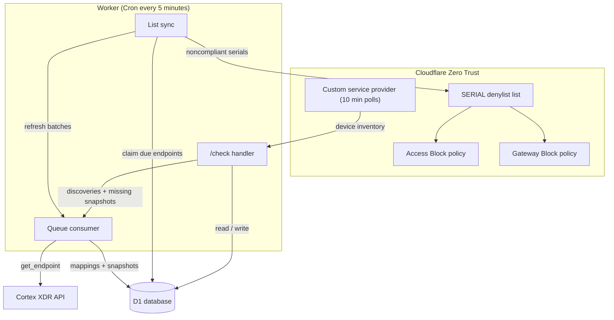
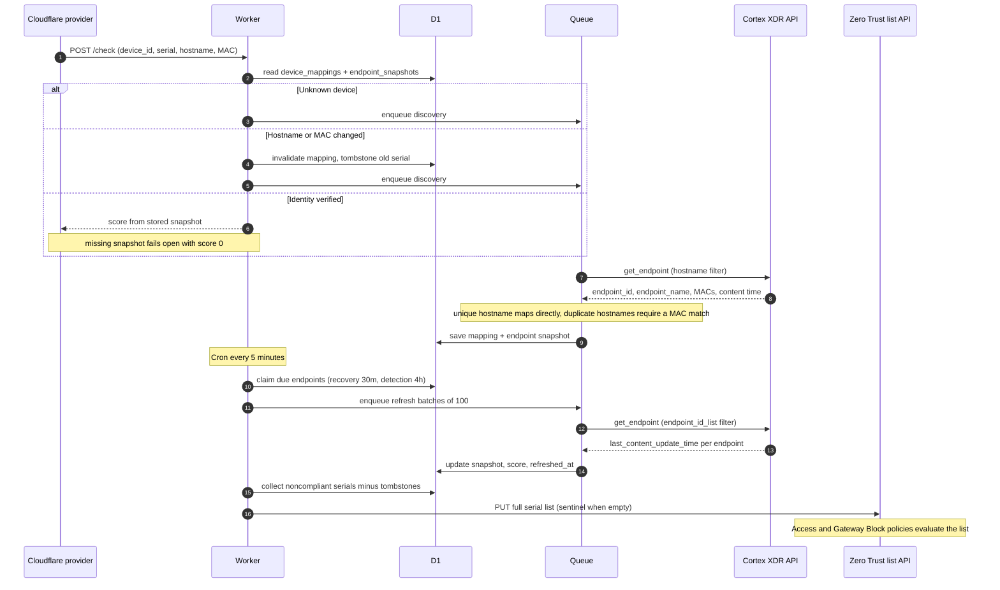
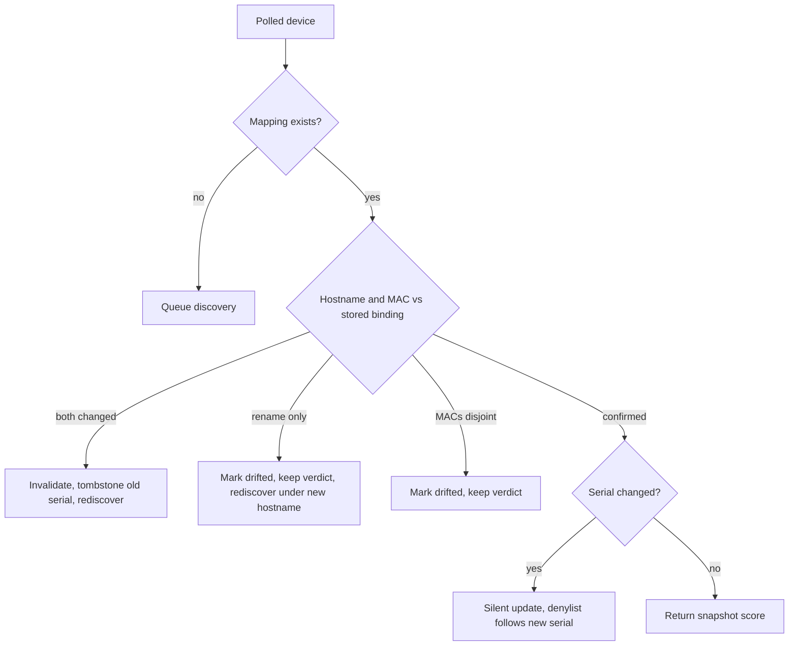
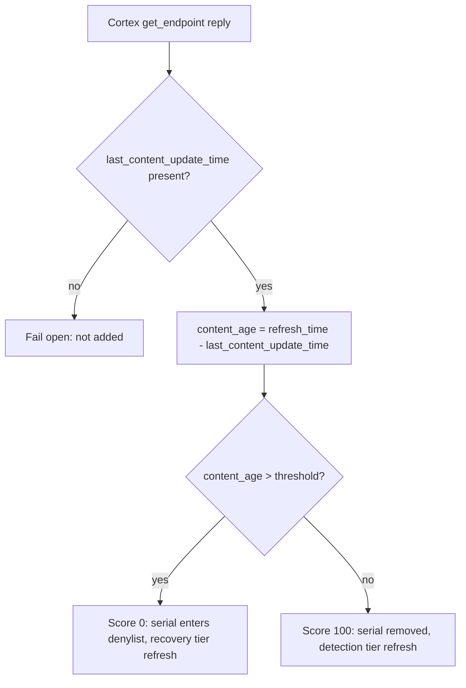

# Architecture guide

This guide details every API call, where data is stored, and how the Worker
compares it. For the high-level overview, see the
[README](../README.md#how-it-works).

## Contents

- [System context](#system-context)
- [End-to-end data flow](#end-to-end-data-flow)
- [Data lifecycle](#data-lifecycle)
- [Decision logic](#decision-logic)
- [API reference](#api-reference)
- [Data storage](#data-storage)

## System context

The Worker only maintains the list. Enforcement happens inside Cloudflare when
Access or Gateway policies evaluate the device's serial against the list.

## End-to-end data flow

Poll cadence: Cloudflare delivers inventory on its own schedule (about every
10 minutes while devices are online). The Worker answers from stored snapshots
without calling Cortex, so poll latency does not depend on Cortex availability.

## Data lifecycle

There is no nightly bulk import from Cortex. The D1 inventory reconciles
continuously — each mechanism below runs on its own cadence and writes only
what changed:

| Mechanism | Cadence | Effect in D1 |
| --- | --- | --- |
| Detection sweep | Every 4 hours per endpoint (`DETECTION_REFRESH_MINUTES`) | Cortex refresh upserts each known endpoint's `endpoint_snapshots` row: content time, score, reason, `cortex_refreshed_at` |
| Recovery sweep | Every 30 minutes per denylisted endpoint (`RECOVERY_REFRESH_MINUTES`) | Same upsert, prioritized so recovered devices are unblocked promptly |
| Provider poll | About every 10 minutes while devices are online | Re-verifies each stored mapping's hostname and MAC; touches `last_seen_at` at most once per device per day |
| Discovery | On demand, when a poll reports an unknown or invalidated device | Inserts the `device_mappings` row and first `endpoint_snapshots` row via hostname lookup |
| Re-discovery | Hourly, for mappings whose Cortex endpoint disappeared | Re-points the mapping to the current `endpoint_id` (same hostname) after agent reinstalls |
| Stale-device cleanup | Daily, and only while the provider is polling | Deletes mappings unseen for `STALE_DEVICE_DAYS` (default 30) and tombstones their serials |
| List sync | Every 5 minutes, skipped when nothing changed | Reads the compliance decision and replaces the Zero Trust list |

Over a single day at defaults, a 12,000-device fleet accumulates six detection
sweeps per endpoint (72,000 endpoint refreshes in 720 batched Cortex requests),
one `last_seen_at` touch per device, and writes only for genuine churn — new
devices, renames, NIC changes, serial changes, and departures. Departed
machines are the only rows ever deleted, and only after 30 days of silence,
so a transient outage can never remove a device.

To verify that the enforceable subset covers the whole Cortex fleet, run the
dashboard's **Coverage audit**: it scans the recently seen Cortex inventory
(`windowDays`, default 30) and reports endpoints that have no Cloudflare
device. Uncovered endpoints are enrollment gaps — they are reported, never
imported, because a serial without a Cloudflare device can never be evaluated
by a policy.

## Decision logic

### /check identity check (per polled device)

- MAC comparison is set-based: every MAC the poll reports must be unknown to
  the binding's verified MAC set before drift is declared, and either side
  being empty never counts as drift. A multi-NIC machine whose reported MAC
  ordering changes is always confirmed, and a newly observed MAC appearing
  alongside a known one is absorbed into the set.
- Drift never unbinds a device. The last verdict keeps serving while the
  binding is flagged, because unbinding on a rename or a NIC change would let
  a stale machine escape the denylist by renaming itself.
- Hostname and MAC changing together is the replacement signature (clone or
  re-provisioned enrollment) and does unbind: invalidate, tombstone, rediscover.
- A serial change never invalidates the mapping — it is silently updated so
  the denylist entry follows the current hardware.

### Cortex matching at discovery

1. Normalize the polled hostname (trim, drop the trailing dot, lowercase) and
   query Cortex by hostname.
2. **MAC evidence**: intersect the candidates' `mac_address[]` sets with the
   polled MAC. Exactly one match → bind, method `mac`. A disjoint MAC set
   never rules a candidate out — the two systems may each name a different
   adapter of the same machine. Zero matches → continue to step 3. Multiple
   matches → refuse (`ambiguous`), fail open.
3. **Unique or liveness-pruned hostname**: a single candidate binds with
   method `hostname`; several candidates where all but one were last seen
   more than 30 days ago bind to the live one. Anything else → refuse.
4. **Contention guard**: a candidate endpoint already bound to a *different*
   device that still polls (seen within 7 days) is rejected — that is a
   clone's claim, and sharing an endpoint would let two devices inherit one
   posture. Two devices in the same poll resolving to one endpoint also
   reject each other.
5. The binding's `bind_method` (`mac` / `hostname` / `pinned`) is recorded,
   and `/api/overview` reports the counts per method. Enable **Require MAC
   corroboration** in the dashboard to make step 3 refuse (`mac_required`)
   instead of binding hostname-only matches — check the method counts first
   to see how many bindings would be affected.

**Future upgrade — endpoint alias stamping.** The Cortex `get_endpoint` API
supports filtering by `alias` (verified against the tenant), `alias` is empty
across this fleet, and it exposes no hardware serial or BIOS UUID at all. A
future version can therefore stamp `alias = <cloudflare device_id>` on the
matched endpoint at discovery and re-verify by that exact key, eliminating
hostname from re-verification entirely. The alias lives on the Cortex
*endpoint* record, so a clone registering as a new endpoint never inherits
it — making alias mismatch a clone detector in its own right. Requires a
Cortex API key with write scope; not implemented in this version.

### Compliance decision (per refreshed endpoint)

- The threshold is the dashboard-managed content age setting
  (`maxContentAgeDays`, default 7 days).
- Content age is measured at the successful Cortex refresh time, so
  wall-clock aging during an outage cannot create a new denial.
- Only `last_content_update_time` matters. Cortex `operational_status` and
  `last_seen` are stored for visibility but never affect the decision.
- Denylisted endpoints are re-checked every 30 minutes (recovery tier) so
  recovered devices are unblocked promptly; everything else is swept every
  4 hours (detection tier).

## API reference

### Inbound: Cloudflare provider → `POST /check`

| Field | Use |
| --- | --- |
| `device_id` | Cloudflare device UUID (primary key of a mapping) |
| `hostname` | Identity: compared against the mapped endpoint name |
| `mac_address` | Identity: compared against the mapping's verified MAC |
| `serial_number` | Enforcement key tracked for the denylist |
| `email`, `virtual_ipv4` | Stored for visibility only |

Response: `{"result": {"<device_id>": {"s2s_id": "<endpoint_id>", "score": 0-100}}}`.
Up to 1,000 devices per request.

### Outbound: Cortex XDR API

One endpoint, two filters:

| Call | Body | When |
| --- | --- | --- |
| `POST /public_api/v1/endpoints/get_endpoint` | `filters: [{field: "hostname", operator: "in", value: [...]}]`, paginated 100/page, 10 hostnames per request | Discovery of unknown or invalidated devices |
| `POST /public_api/v1/endpoints/get_endpoint` | `filters: [{field: "endpoint_id_list", operator: "in", value: [...]}]`, 100 IDs per request | Scheduled refresh of known endpoints |

Authentication (advanced API key): `x-xdr-auth-id` carries the key ID,
`x-xdr-nonce` a random value, `x-xdr-timestamp` the epoch time, and
`authorization` the hex SHA-256 digest of `API key + nonce + timestamp`.
Standard keys send the API key directly in `authorization`.

Expected reply fields per endpoint: `endpoint_id`, `endpoint_name`,
`mac_address[]`, `last_content_update_time`, `last_seen`,
`operational_status`.

Resilience: 3 attempts with backoff, `retry-after` honored on 429/5xx,
15-second timeout per attempt. Every request/response pair is optionally
recorded in the debug log with the authorization redacted.

### Outbound: Cloudflare Zero Trust Lists API

| Call | Purpose |
| --- | --- |
| List `SERIAL` lists | Dashboard list selector and pre-write validation (ID, name, type) |
| Replace list items | Full-set replacement with the noncompliant serials, or the `__cortex_no_noncompliant_devices__` sentinel when empty |

The sync validates the configured capacity before writing, skips the PUT when
nothing changed, re-reads the list after writing to verify, and holds a D1
lease so overlapping Cron runs cannot interleave replacements. Entries carry
`hostname=<name>; mac=<address>` descriptions for operators.

## Data storage

All state lives in D1:

| Table | Purpose |
| --- | --- |
| `device_mappings` | One row per Cloudflare device: `cortex_endpoint_id`, hostname, verified MAC, serial, status, `last_seen_at` |
| `endpoint_snapshots` | One row per Cortex endpoint: `last_content_update_time`, score, reason, `cortex_refreshed_at` |
| `serial_removals` | Durable tombstones that remove invalidated or changed serials from the denylist |
| `device_observations` | Concurrency guard: mapping writes only apply to observations from the same poll |
| `refresh_leases`, `sync_leases` | Prevent duplicate Cortex refreshes and list replacements across overlapping runs |
| `app_settings` | Dashboard-managed settings and provider liveness (`last_check_at`) |
| `integration_status` | Health-pill state for the Cortex and list integrations |
| `debug_log` | Last 200 Cortex request/response pairs for the dashboard popup |

The Worker self-provisions this entire schema on the first Cron run, so a
deployment bound to a fresh database recovers without manual migrations.
